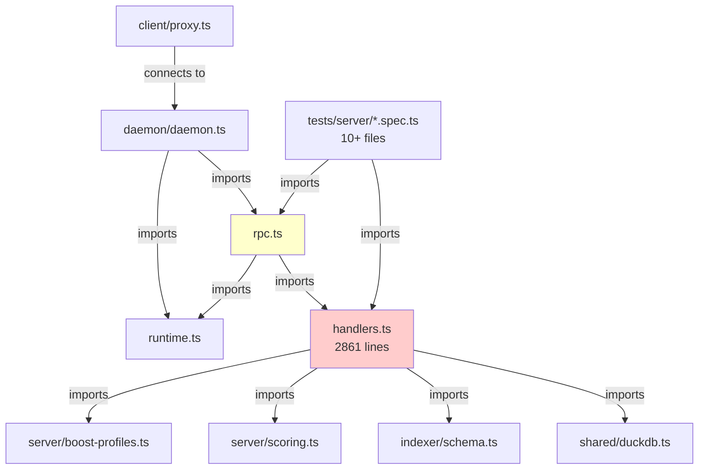

# Refactoring Analysis Report - KIRI Project

**Module**: Server, Client, Daemon, Shared
**Analyzed By**: Claude Code with Refactoring Discovery Skill
**Date**: 2025-01-13
**Analysis Duration**: ~30 minutes

---

## Executive Summary

**Total Issues Found**: 7
**Critical (P0)**: 0
**High (P1)**: 3
**Medium (P2)**: 3
**Low (P3)**: 1

**Key Findings**:

- **src/server/handlers.ts** is a god file (2861 lines) violating Single Responsibility Principle
- **src/server/rpc.ts** uses large switch statement (15 cases) violating Open/Closed Principle
- **resolveRepoId** function has multiple responsibilities (path normalization, DB access, error handling)
- Overall architecture is sound but needs modularization for maintainability

**Recommended Priority** (endorsed by Codex CLI):

1. **Issue #1** - Split handlers.ts into modular components (P1)
2. **Issue #2** - Refactor rpc.ts switch to handler registry pattern (P1)
3. **Issue #3** - Extract resolveRepoId responsibilities into separate services (P1)

---

## Module Overview

### Structure

- **Files Analyzed**: 5 main modules (server, client, daemon, shared/cli)
- **Total Lines of Code**: ~4,649 (server modules only)
- **Average File Size**: 930 lines (server modules)
- **Largest File**: `src/server/handlers.ts` (2861 lines) ⚠️

### Dependencies

```
Server Module
├── depends on: shared (DuckDBClient, utils), indexer (schema)
└── used by: daemon, client/proxy, tests (10+ test files)

Client/Proxy Module
├── depends on: shared/utils/socket, client/start-daemon
└── used by: external MCP clients

Daemon Module
├── depends on: server (runtime, rpc), shared/utils/socket
└── used by: client/proxy (auto-started)

Shared/CLI Module (New)
├── depends on: Node.js built-ins
└── used by: server, client, daemon
```

### Complexity Metrics

- **Highest Complexity File**: handlers.ts (30+ functions, 2861 lines)
- **Functions >50 Lines**: ~5 identified (deps_closure ~86 lines, resolveRepoId 39 lines)
- **Large Switch Statement**: rpc.ts createRpcHandler (15 cases, ~200 lines)

---

## Issue #1: God File - handlers.ts (2861 lines)

**Location**: `src/server/handlers.ts:1-2827`
**Type**: Single Responsibility Principle Violation
**Severity**: High (P1)
**Effort**: Large (2-3 days)

### Problem Description

The `src/server/handlers.ts` file contains 2861 lines with 30+ functions, far exceeding the recommended threshold of 500 lines. This file mixes multiple responsibilities:

1. MCP tool handler implementations (context_bundle, files_search, snippets_get, deps_closure)
2. Helper functions (parsing, normalization, token estimation)
3. Repository resolution logic
4. FTS status management
5. Scoring and boosting algorithms
6. Configuration file detection
7. Dependency graph traversal

This violates the Single Responsibility Principle and creates several problems:

- Difficult to navigate and understand
- High risk of merge conflicts
- Slow to compile and test
- Unclear module boundaries
- Hard to refactor individual components

### Current Implementation

```typescript
// File structure (simplified):
src/server/handlers.ts (2861 lines)
├── CONFIG_FILES constant (100+ lines)
├── hasDirtyRepos()
├── refreshFtsStatus()
├── getFreshFtsStatus()
├── isConfigFile()
├── parseOutputOptions()
├── buildPreview()
├── extractKeywords()
├── applyStructuralScores()
├── applyFileTypeBoost()
├── applyPathBasedScoring()
├── ... (20+ more functions)
├── contextBundle() - Main handler
├── semanticRerank() - Main handler
├── filesSearch() - Main handler
├── snippetsGet() - Main handler
├── depsClosure() - Main handler (86 lines!)
└── resolveRepoId() - Utility (39 lines, multiple responsibilities)
```

**Issues**:

- Mixed concerns: handlers, helpers, utilities, repository logic
- No clear module structure or separation
- Functions at different abstraction levels
- Difficult to unit test in isolation
- 10+ test files all import from this single file (tight coupling)

### Recommended Refactoring

**Approach**: Extract Module Pattern + Separation of Concerns

**Proposed Structure**:

```
src/server/
├── handlers/
│   ├── context-bundle.ts        // contextBundle handler + helpers
│   ├── semantic-rerank.ts       // semanticRerank handler + helpers
│   ├── files-search.ts          // filesSearch handler + helpers
│   ├── snippets-get.ts          // snippetsGet handler + helpers
│   ├── deps-closure.ts          // depsClosure handler + helpers
│   └── index.ts                 // Re-export public API
├── services/
│   ├── repo-resolver.ts         // Repository resolution logic
│   ├── fts-status.ts            // FTS status management
│   ├── scoring.ts               // Scoring algorithms (keep existing)
│   └── boost-profiles.ts        // Boost profiles (keep existing)
├── utils/
│   ├── config-files.ts          // CONFIG_FILES constant + isConfigFile()
│   ├── token-estimation.ts      // Token counting utilities
│   ├── preview-builder.ts       // Preview/snippet generation
│   └── keyword-extraction.ts    // Keyword parsing logic
└── rpc.ts                       // Handler registry (refactored separately)
```

**Example Refactored Module** (`src/server/handlers/context-bundle.ts`):

```typescript
import { DuckDBClient } from "../../shared/duckdb.js";
import { ServerContext } from "../context.js";
import { getFreshFtsStatus } from "../services/fts-status.js";
import { extractKeywords } from "../utils/keyword-extraction.js";
import { applyStructuralScores, applyFileTypeBoost } from "../services/scoring.js";

/**
 * Context Bundle Handler
 *
 * Implements the context_bundle MCP tool for semantic code search.
 */
export async function contextBundle(
  params: ContextBundleParams,
  context: ServerContext,
  degrade: DegradeState,
  allowDegrade: boolean
): Promise<ContextBundleResult> {
  // Implementation focused on context_bundle logic only
  // All helpers specific to this handler stay in this file
  // Shared utilities imported from services/utils
}

// Helper functions specific to context_bundle
function normalizeLimit(limit?: number): number {
  // ...
}

function ensureCandidate(map: Map<string, CandidateInfo>, filePath: string): CandidateInfo {
  // ...
}
```

**Benefits**:

- **Clear boundaries**: Each handler module has single responsibility
- **Better testability**: Can test handlers in isolation
- **Easier navigation**: Developers can find code quickly
- **Reduced coupling**: Test files import specific handlers, not monolithic file
- **Parallel development**: Multiple developers can work on different handlers without conflicts
- **Incremental refactoring**: Can migrate handlers one at a time
- **Better IDE performance**: Faster compilation and autocomplete

### Impact Analysis

**Files to Modify**:

- `src/server/handlers.ts` - Split into multiple modules (main work)
- `src/server/rpc.ts` - Update imports to new handler modules
- `src/server/runtime.ts` - Update imports if needed
- `tests/server/*.spec.ts` - Update imports (10+ test files)
- `src/index.ts` - Update public API exports

**Risk Level**: Medium-High

- High-impact change affecting many files
- Requires careful import management
- Test suite must pass after refactoring
- BUT: TypeScript compiler will catch most issues

**Testing Strategy**:

- Run full test suite before starting (`pnpm test`)
- Migrate one handler at a time (e.g., start with `snippets_get`)
- Run tests after each handler migration
- Use TypeScript compiler to verify imports
- Final integration test with all handlers migrated

---

## Issue #2: Open/Closed Principle Violation - rpc.ts Switch Statement

**Location**: `src/server/rpc.ts:770-999`
**Type**: Open/Closed Principle Violation
**Severity**: High (P1)
**Effort**: Medium (1-2 days)

### Problem Description

The `createRpcHandler` function uses a large switch statement with 15 cases to route JSON-RPC requests to handler functions. This violates the Open/Closed Principle because:

- Adding new MCP tools requires modifying the switch statement
- No extension point for plugins or external handlers
- Tight coupling between routing logic and handler implementations
- Difficult to test routing independently

After Issue #1 (splitting handlers.ts), this switch statement becomes even more problematic because it will need to import from many separate handler modules.

### Current Implementation

```typescript
export function createRpcHandler(
  dependencies: RpcHandlerDependencies
): (payload: JsonRpcRequest) => Promise<RpcHandleResult | null> {
  // ... setup code ...

  return async (payload: JsonRpcRequest): Promise<RpcHandleResult | null> => {
    switch (payload.method) {
      case "initialize": {
        /* ... */ break;
      }
      case "ping": {
        /* ... */ break;
      }
      case "tools/list": {
        /* ... */ break;
      }
      case "resources/list": {
        /* ... */ break;
      }
      case "tools/call": {
        /* ... */ break;
      }
      case "context_bundle": {
        /* ... */ break;
      }
      case "semantic_rerank": {
        /* ... */ break;
      }
      case "files_search": {
        /* ... */ break;
      }
      case "snippets_get": {
        /* ... */ break;
      }
      case "deps_closure": {
        /* ... */ break;
      }
      // ... 5 more cases ...
      default: {
        /* error */
      }
    }
  };
}
```

**Issues**:

- Violates OCP: Must modify function to add new tools
- No type safety for handler signatures
- Difficult to test individual route handlers
- Repetitive code pattern in each case
- Hard to add middleware or interceptors

### Recommended Refactoring

**Approach**: Strategy Pattern + Handler Registry

**Proposed Design**:

```typescript
// src/server/handlers/base.ts
import { ServerContext } from "../context.js";
import { DegradeState } from "../runtime.js";

export type HandlerFunction<TParams = unknown, TResult = unknown> = (
  params: TParams,
  context: ServerContext,
  degrade: DegradeState,
  allowDegrade: boolean
) => Promise<TResult>;

export interface HandlerDescriptor<TParams = unknown, TResult = unknown> {
  name: string;
  handler: HandlerFunction<TParams, TResult>;
  isLegacy?: boolean;
}

// src/server/handlers/registry.ts
export class HandlerRegistry {
  private handlers = new Map<string, HandlerDescriptor>();

  register<TParams, TResult>(descriptor: HandlerDescriptor<TParams, TResult>): void {
    this.handlers.set(descriptor.name, descriptor);
  }

  get(name: string): HandlerDescriptor | undefined {
    return this.handlers.get(name);
  }

  getAllHandlers(): HandlerDescriptor[] {
    return Array.from(this.handlers.values());
  }
}

// src/server/handlers/context-bundle.ts
import { HandlerDescriptor } from "./base.js";

export const contextBundleHandler: HandlerDescriptor = {
  name: "context_bundle",
  handler: async (params, context, degrade, allowDegrade) => {
    // Implementation
  },
  isLegacy: true,
};

// src/server/handlers/index.ts
import { HandlerRegistry } from "./registry.js";
import { contextBundleHandler } from "./context-bundle.js";
import { semanticRerankHandler } from "./semantic-rerank.js";
import { filesSearchHandler } from "./files-search.js";
import { snippetsGetHandler } from "./snippets-get.js";
import { depsClosureHandler } from "./deps-closure.js";

export function createHandlerRegistry(): HandlerRegistry {
  const registry = new HandlerRegistry();

  // Register all handlers
  registry.register(contextBundleHandler);
  registry.register(semanticRerankHandler);
  registry.register(filesSearchHandler);
  registry.register(snippetsGetHandler);
  registry.register(depsClosureHandler);

  return registry;
}

// src/server/rpc.ts (refactored)
export function createRpcHandler(
  dependencies: RpcHandlerDependencies
): (payload: JsonRpcRequest) => Promise<RpcHandleResult | null> {
  const { context, degrade, metrics, tokens, allowDegrade } = dependencies;
  const registry = createHandlerRegistry();

  const buildRequestContext = (): ServerContext => {
    const warningManager = context.warningManager.fork();
    warningManager.startRequest();
    return { ...context, warningManager };
  };

  return async (payload: JsonRpcRequest): Promise<RpcHandleResult | null> => {
    const hasResponseId = typeof payload.id === "string" || typeof payload.id === "number";

    try {
      let result: unknown;

      // Handle standard MCP methods
      if (payload.method === "initialize") {
        result = INITIALIZE_PAYLOAD;
      } else if (payload.method === "ping") {
        result = {
          status: "ok",
          serverInfo: SERVER_INFO,
          pid: process.pid,
          uptime: process.uptime(),
        };
      } else if (payload.method === "tools/list") {
        result = { tools: TOOL_DESCRIPTORS };
      } else if (payload.method === "resources/list") {
        result = { resources: [] };
      } else if (payload.method === "tools/call") {
        // MCP standard tool invocation
        const paramsRecord = payload.params as Record<string, unknown> | null | undefined;
        if (!paramsRecord || typeof paramsRecord !== "object") {
          return hasResponseId ? { statusCode: 400, response: errorResponse(/* ... */) } : null;
        }

        const toolName = paramsRecord.name as string;
        const handler = registry.get(toolName);
        if (!handler) {
          return hasResponseId ? { statusCode: 404, response: errorResponse(/* ... */) } : null;
        }

        const scopedContext = buildRequestContext();
        const toolResult = await handler.handler(
          paramsRecord.arguments,
          scopedContext,
          degrade,
          allowDegrade
        );

        result = {
          content: [{ type: "text", text: JSON.stringify(toolResult, null, 2) }],
          isError: false,
        };
      } else {
        // Legacy direct method invocation (backward compatibility)
        const handler = registry.get(payload.method);
        if (!handler || !handler.isLegacy) {
          return hasResponseId ? { statusCode: 404, response: errorResponse(/* ... */) } : null;
        }

        const scopedContext = buildRequestContext();
        result = await handler.handler(payload.params, scopedContext, degrade, allowDegrade);
      }

      // Masking and response handling (unchanged)
      const masked = maskValue(result, { tokens, skipKeys: RESPONSE_MASK_SKIP_KEYS });
      // ...
    } catch (error) {
      // Error handling (unchanged)
    }
  };
}
```

**Benefits**:

- **OCP compliance**: Add new handlers without modifying rpc.ts
- **Type safety**: Handler signatures enforced by TypeScript
- **Testability**: Can test registry and handlers independently
- **Extensibility**: Easy to add middleware, interceptors, or validation
- **Clear separation**: Routing logic separate from handler implementation
- **Self-documenting**: Registry shows all available handlers

### Impact Analysis

**Files to Modify**:

- `src/server/handlers/base.ts` - Create (new file)
- `src/server/handlers/registry.ts` - Create (new file)
- `src/server/handlers/index.ts` - Update to export registry
- `src/server/rpc.ts` - Refactor switch to use registry (~100 lines changed)
- Individual handler files - Add HandlerDescriptor export

**Risk Level**: Medium

- Requires coordinated changes to rpc.ts and handler modules
- Must maintain backward compatibility for legacy methods
- BUT: Well-defined interfaces reduce risk

**Testing Strategy**:

- Test HandlerRegistry in isolation
- Test each handler as HandlerDescriptor
- Integration test: verify all legacy methods still work
- Integration test: verify tools/call routing works
- Verify error handling for unknown methods

---

## Issue #3: Multiple Responsibilities - resolveRepoId Function

**Location**: `src/server/handlers.ts:2788-2826`
**Type**: Single Responsibility Principle Violation
**Severity**: High (P1)
**Effort**: Small-Medium (4-6 hours)

### Problem Description

The `resolveRepoId` function is 39 lines long and handles multiple responsibilities:

1. **Path normalization**: Calls `getRepoPathCandidates()` and `normalizeRepoPath()`
2. **Database lookup**: Queries `repo` table with IN clause
3. **Fallback search**: Iterates through all repos if no direct match
4. **Path update logic**: Updates repo path if normalized version differs
5. **Error handling**: Catches and re-throws specific errors
6. **Edge case handling**: Checks for empty results

This makes the function hard to test, difficult to mock for unit tests, and violates the Single Responsibility Principle.

### Current Implementation

```typescript
export async function resolveRepoId(db: DuckDBClient, repoRoot: string): Promise<number> {
  try {
    const candidates = getRepoPathCandidates(repoRoot);
    const normalized = candidates[0];
    const placeholders = candidates.map(() => "?").join(", ");
    const rows = await db.all<{ id: number; root: string }>(
      `SELECT id, root FROM repo WHERE root IN (${placeholders}) LIMIT 1`,
      candidates
    );

    if (rows.length === 0) {
      const existingRows = await db.all<{ id: number; root: string }>("SELECT id, root FROM repo");
      for (const candidate of existingRows) {
        if (normalizeRepoPath(candidate.root) === normalized) {
          await db.run("UPDATE repo SET root = ? WHERE id = ?, [normalized, candidate.id])");
          return candidate.id;
        }
      }
      throw new Error(
        "Target repository is missing from DuckDB. Run the indexer before starting the server."
      );
    }
    const row = rows[0];
    if (!row) {
      throw new Error("Failed to retrieve repository record. Database returned empty result.");
    }
    if (row.root !== normalized) {
      await db.run("UPDATE repo SET root = ? WHERE id = ?", [normalized, row.id]);
    }
    return row.id;
  } catch (error) {
    if (error instanceof Error && error.message.includes("Table with name repo")) {
      throw new Error(
        "Target repository is missing from DuckDB. Run the indexer before starting the server."
      );
    }
    throw error;
  }
}
```

**Issues**:

- Mixed concerns: normalization + lookup + update + error handling
- Hard to test: Requires full database setup
- Hard to mock: Direct DB calls throughout
- Unclear flow: Multiple return points and branches
- Inefficient fallback: Loads all repos if no match (O(n) scan)

### Recommended Refactoring

**Approach**: Extract Service Pattern + Repository Pattern

**Proposed Design**:

```typescript
// src/shared/utils/path-normalizer.ts
export class RepoPathNormalizer {
  /**
   * Normalizes a repository path to canonical form
   */
  normalize(root: string): string {
    return normalizeRepoPath(root);
  }

  /**
   * Gets all candidate paths (normalized + variations)
   */
  getCandidates(root: string): string[] {
    return getRepoPathCandidates(root);
  }
}

// src/server/services/repo-repository.ts
export interface RepoRecord {
  id: number;
  root: string;
}

export class RepoRepository {
  constructor(private db: DuckDBClient) {}

  /**
   * Finds a repository by exact path match (any of the candidates)
   */
  async findByPaths(candidates: string[]): Promise<RepoRecord | null> {
    const placeholders = candidates.map(() => "?").join(", ");
    const rows = await this.db.all<RepoRecord>(
      `SELECT id, root FROM repo WHERE root IN (${placeholders}) LIMIT 1`,
      candidates
    );
    return rows[0] || null;
  }

  /**
   * Finds a repository by normalized path (fallback, slower)
   */
  async findByNormalizedPath(normalized: string): Promise<RepoRecord | null> {
    // NOTE: This is O(n) - consider adding normalized_root column + index
    const allRepos = await this.db.all<RepoRecord>("SELECT id, root FROM repo");
    return allRepos.find((repo) => normalizeRepoPath(repo.root) === normalized) || null;
  }

  /**
   * Updates repository root path
   */
  async updateRoot(id: number, newRoot: string): Promise<void> {
    await this.db.run("UPDATE repo SET root = ? WHERE id = ?", [newRoot, id]);
  }

  /**
   * Checks if repo table exists
   */
  async tableExists(): Promise<boolean> {
    try {
      await this.db.all("SELECT 1 FROM repo LIMIT 1");
      return true;
    } catch (error) {
      return false;
    }
  }
}

// src/server/services/repo-resolver.ts
export class RepoNotFoundError extends Error {
  constructor(message: string) {
    super(message);
    this.name = "RepoNotFoundError";
  }
}

export class RepoResolver {
  constructor(
    private repository: RepoRepository,
    private normalizer: RepoPathNormalizer
  ) {}

  /**
   * Resolves a repository root path to its database ID
   *
   * @throws RepoNotFoundError if repository is not indexed
   */
  async resolveId(repoRoot: string): Promise<number> {
    // Check if table exists first
    const tableExists = await this.repository.tableExists();
    if (!tableExists) {
      throw new RepoNotFoundError(
        "Target repository is missing from DuckDB. Run the indexer before starting the server."
      );
    }

    // Get candidates and normalized path
    const candidates = this.normalizer.getCandidates(repoRoot);
    const normalized = candidates[0];

    // Try direct lookup first (fast path)
    let repo = await this.repository.findByPaths(candidates);

    // If not found, try normalized fallback (slow path)
    if (!repo) {
      repo = await this.repository.findByNormalizedPath(normalized);

      if (!repo) {
        throw new RepoNotFoundError(
          "Target repository is missing from DuckDB. Run the indexer before starting the server."
        );
      }

      // Update to normalized path for future fast lookups
      await this.repository.updateRoot(repo.id, normalized);
    }

    // Ensure path is normalized
    if (repo.root !== normalized) {
      await this.repository.updateRoot(repo.id, normalized);
    }

    return repo.id;
  }
}

// src/server/handlers.ts (refactored usage)
import { RepoResolver } from "../services/repo-resolver.js";
import { RepoRepository } from "../services/repo-repository.js";
import { RepoPathNormalizer } from "../../shared/utils/path-normalizer.js";

// Create resolver (could be done in runtime.ts and passed in context)
const normalizer = new RepoPathNormalizer();
const repository = new RepoRepository(db);
const resolver = new RepoResolver(repository, normalizer);

// Usage
try {
  const repoId = await resolver.resolveId(repoRoot);
} catch (error) {
  if (error instanceof RepoNotFoundError) {
    // Handle gracefully
  }
  throw error;
}
```

**Benefits**:

- **Clear separation**: Each class has one responsibility
- **Testability**: Can unit test each component with mocks
- **Type safety**: Custom error types
- **Reusability**: Components can be used elsewhere
- **Maintainability**: Easy to add caching or optimization
- **Performance opportunity**: Can add normalized_root column + index later
- **Better error handling**: Explicit error types instead of string matching

### Impact Analysis

**Files to Create**:

- `src/shared/utils/path-normalizer.ts` - Path normalization service
- `src/server/services/repo-repository.ts` - Repository data access
- `src/server/services/repo-resolver.ts` - Resolution orchestration

**Files to Modify**:

- `src/server/handlers.ts` - Replace resolveRepoId calls with RepoResolver
- `src/server/runtime.ts` - Create RepoResolver instance in ServerContext
- `tests/server/resolve-repo.spec.ts` - Update tests for new structure

**Risk Level**: Low-Medium

- Well-defined interfaces reduce risk
- Can implement incrementally (create new classes, migrate callers, delete old function)
- Existing tests should pass with minimal changes

**Testing Strategy**:

- Unit test `RepoPathNormalizer` (pure functions, easy to test)
- Unit test `RepoRepository` with mock DuckDBClient
- Unit test `RepoResolver` with mock repository and normalizer
- Integration test with real database
- Verify all existing resolve-repo tests still pass

---

## Issue #4: Large Function - depsClosure (86 lines)

**Location**: `src/server/handlers.ts:2619-2786`
**Type**: Complexity / Long Method
**Severity**: Medium (P2)
**Effort**: Small (2-3 hours)

### Problem Description

The `depsClosure` function is 86 lines long (threshold is 50 lines) and performs complex graph traversal logic with multiple nested loops and conditionals. While not as critical as the other issues, this function could benefit from extraction to improve readability.

### Recommended Refactoring

**Approach**: Extract Method

Break down into smaller functions:

- `buildDependencyGraph()` - Main graph traversal
- `recordNode()` and `recordEdge()` - Graph mutation
- `traverseInbound()` and `traverseOutbound()` - Direction-specific logic
- `sortResults()` - Result sorting

This can be addressed as part of Issue #1 when splitting handlers.ts.

---

## Issue #5: Duplicate Argument Parsing Logic

**Location**: Multiple files

- `src/client/proxy.ts:37-67` (parseProxyArgs)
- `src/daemon/daemon.ts:38-68` (parseDaemonArgs)
- `src/server/main.ts` (similar pattern)

**Type**: Code Duplication / DRY Violation
**Severity**: Medium (P2)
**Effort**: Small (2-3 hours)

### Problem Description

Client, daemon, and server all have similar argument parsing logic with repeated patterns for:

- `repo`, `db`, `socket-path`, `watch`, `allow-degrade`
- Path resolution with defaults
- Socket path derivation

The new `src/shared/cli/args.ts` module (154 lines) appears to be created to address this, which is good! However, it's not yet integrated.

### Recommended Refactoring

**Approach**: Complete the CLI module integration

Ensure `src/shared/cli/args.ts` provides shared argument parsing utilities and update proxy, daemon, and server to use them. This eliminates duplication and ensures consistency.

**Benefits**:

- Single source of truth for argument parsing
- Consistent behavior across all entry points
- Easier to add new arguments
- Better testability (already has test file)

---

## Issue #6: Mixed Configuration - CONFIG_FILES Constant

**Location**: `src/server/handlers.ts:21-120`
**Type**: Misplaced Constant / Low Cohesion
**Severity**: Medium (P2)
**Effort**: Trivial (15 minutes)

### Problem Description

The `CONFIG_FILES` constant (100+ lines) is defined in handlers.ts but is only used by one function (`isConfigFile`). This constant has nothing to do with MCP handlers - it's a general utility.

### Recommended Refactoring

**Approach**: Move to shared utilities

As part of Issue #1, move this to `src/server/utils/config-files.ts` or even `src/shared/utils/config-files.ts` if it might be used by indexer.

**Benefit**: Better organization, clearer module boundaries.

---

## Issue #7: Japanese Comments in Production Code

**Location**: Multiple files

- `src/server/handlers.ts:2712` - "direction に応じて使用するマップを選択"
- `src/server/handlers.ts:2720` - "inbound: edge.src_path がこのファイルを使用している"
- `src/server/handlers.ts:2734` - "outbound: このファイルが edge.dst を使用している"
- `src/client/proxy.ts:20` - "プロキシ設定オプション"
- `src/client/proxy.ts:35` - "CLI引数をパース"
- `src/client/proxy.ts:70` - "デーモンのバージョンをチェック"
- `src/daemon/daemon.ts:22` - "デーモン設定オプション"
- `src/daemon/daemon.ts:36` - "CLI引数をパース"
- `src/daemon/daemon.ts:71` - "メイン関数：デーモンプロセスを起動"

**Type**: Code Style / Internationalization Issue
**Severity**: Low (P3)
**Effort**: Trivial (30 minutes)

### Problem Description

Several files contain Japanese comments mixed with English code. While technically functional, this creates issues:

- Not accessible to non-Japanese-speaking contributors
- Inconsistent with project conventions (most code has English comments)
- May cause encoding issues in some editors

### Recommended Refactoring

**Approach**: Translate to English or use JSDoc

Convert Japanese comments to English or remove if they duplicate obvious code. For interface/type documentation, use proper JSDoc format.

**Example**:

```typescript
// Before
/**
 * プロキシ設定オプション
 */
interface ProxyOptions {

// After
/**
 * Proxy configuration options
 */
interface ProxyOptions {
```

---

## Coupling & Cohesion Analysis

### Coupling Metrics

| Module           | Afferent (Ca)                     | Efferent (Ce)                   | Assessment                      |
| ---------------- | --------------------------------- | ------------------------------- | ------------------------------- |
| handlers.ts      | 10+ (used by many tests + rpc.ts) | ~10 (imports from many modules) | **High coupling - problematic** |
| rpc.ts           | 4 (daemon, socket, tests)         | 2 (handlers, runtime)           | Moderate coupling - acceptable  |
| client/proxy.ts  | 0 (entry point)                   | 2 (start-daemon, socket utils)  | Low coupling - good             |
| daemon/daemon.ts | 0 (entry point)                   | 4 (server modules, socket)      | Low coupling - good             |

**Key Finding**: handlers.ts has very high coupling, which Issue #1 (splitting) will address.

### Cohesion Issues

**Low Cohesion Modules**:

1. `handlers.ts` - Contains unrelated functions (handlers, helpers, utils, repo logic)
   - **Fix**: Split into separate modules (Issue #1)

2. `rpc.ts` - Mixes routing logic with error handling and response formatting
   - **Severity**: Minor (acceptable for a router module)

---

## Architecture Recommendations

### Pattern Improvements

**Missing Patterns**:

1. **Repository Pattern** for Database Access
   - Current: Direct DB calls scattered throughout
   - Proposed: Repository classes (RepoRepository, FileRepository, etc.)
   - Benefits: Better testability, easier to add caching, clearer boundaries

2. **Service Layer** for Business Logic
   - Current: Business logic mixed with handlers
   - Proposed: Service classes (RepoResolver, FtsStatusService, ScoringService)
   - Benefits: Reusable logic, better separation of concerns

3. **Handler Registry** for Extensibility
   - Current: Hard-coded switch statement
   - Proposed: HandlerRegistry with registration mechanism
   - Benefits: OCP compliance, easier to add new tools

**Well-Applied Patterns**:

1. ✅ **Wrapper Pattern** - DuckDBClient provides clean async interface
2. ✅ **Facade Pattern** - Server runtime hides complexity of setup
3. ✅ **Strategy Pattern** - Boost profiles for scoring variations
4. ✅ **Builder Pattern** - FtsStatusCache construction

### Layer Separation

**Current Architecture**:

```
┌──────────────────────────────────────┐
│          handlers.ts (2861 lines)    │  ← Monolithic, mixed concerns
│  • MCP handlers                      │
│  • Helper functions                  │
│  • Repository logic                  │
│  • Utilities                         │
└──────────────────────────────────────┘
          ↓
┌──────────────────────────────────────┐
│        rpc.ts (switch statement)     │  ← Routing tightly coupled
└──────────────────────────────────────┘
```

**Proposed Architecture**:

```
┌─────────────────────────────────────────────────────────┐
│                   MCP Handler Layer                     │
│  context-bundle.ts  │  files-search.ts  │  deps-closure.ts │
│  semantic-rerank.ts │  snippets-get.ts  │                  │
└─────────────────────────────────────────────────────────┘
          ↓
┌─────────────────────────────────────────────────────────┐
│                   Service Layer                         │
│  RepoResolver  │  FtsStatusService  │  ScoringService   │
└─────────────────────────────────────────────────────────┘
          ↓
┌─────────────────────────────────────────────────────────┐
│                  Repository Layer                       │
│  RepoRepository  │  FileRepository  │  SymbolRepository │
└─────────────────────────────────────────────────────────┘
          ↓
┌─────────────────────────────────────────────────────────┐
│                 Data Access Layer                       │
│               DuckDBClient (shared)                     │
└─────────────────────────────────────────────────────────┘
```

**Benefits**:

- Clear separation of concerns
- Each layer has well-defined responsibilities
- Easier to test each layer in isolation
- Better maintainability and extensibility

---

## Code Smell Summary

| Smell                  | Count | Locations                                                | Priority |
| ---------------------- | ----- | -------------------------------------------------------- | -------- |
| **God File**           | 1     | handlers.ts (2861 lines)                                 | **P1**   |
| **Large Switch**       | 1     | rpc.ts createRpcHandler (15 cases)                       | **P1**   |
| **Long Method**        | ~5    | depsClosure (86 lines), resolveRepoId (39 lines), others | P2       |
| **Duplicate Code**     | 3     | parseProxyArgs, parseDaemonArgs, parseServerArgs         | P2       |
| **Misplaced Constant** | 1     | CONFIG_FILES in handlers.ts                              | P2       |
| **Mixed Language**     | ~15   | Japanese comments throughout                             | P3       |

---

## Project-Specific Considerations

### Alignment with KIRI Patterns

**Conformance**:

- ✅ **Three-tier architecture** - indexer/server/shared structure maintained
- ✅ **DuckDBClient wrapper** - Transaction support and resource management
- ✅ **Error message format** - "Problem. Resolution." pattern followed
- ✅ **MCP tool naming** - snake_case convention (context_bundle, files_search)
- ✅ **Degrade-first principle** - Graceful fallback when extensions unavailable
- ❌ **Module size** - handlers.ts exceeds 500-line threshold by 5.7x
- ❌ **OCP compliance** - Switch statement in rpc.ts violates Open/Closed Principle

**Recommendations**:

1. Maintain three-tier architecture during refactoring
2. Keep DuckDBClient usage patterns (transactions, finally blocks)
3. Ensure all extracted modules follow error message conventions
4. Preserve degrade-first principle in new handler modules

### Impact on KIRI Goals

**Token Efficiency**:

- Current: Well-designed (snippet alignment, result limits, compact mode)
- After Refactoring: **No negative impact** - logic remains the same, just better organized
- Potential improvement: Smaller modules may reduce import overhead

**Performance**:

- Current: Good (indexed queries, efficient scoring)
- After Refactoring: **No negative impact** - same algorithms, better structure
- Potential improvement: Repository pattern enables caching layer

**Maintainability**:

- Current: **Problematic** - 2861-line file hard to navigate and modify
- After Refactoring: **Significantly improved** - clear module boundaries, easier to find code
- Developer velocity: **Faster** - less merge conflicts, parallel development

---

## Implementation Roadmap

### Phase 1: Foundation (Week 1) - CRITICAL

**Priority: Complete Issue #1 and Issue #3 first**

- [ ] **Issue #3** - Extract resolveRepoId responsibilities (4-6 hours)
  - Create RepoPathNormalizer
  - Create RepoRepository
  - Create RepoResolver
  - Update callers
  - Update tests

- [ ] **Issue #1 (Part 1)** - Begin handlers.ts split (1-2 days)
  - Create directory structure (handlers/, services/, utils/)
  - Extract snippets-get handler (smallest, least dependencies)
  - Extract config-files utilities
  - Run tests, verify everything works

**Estimated Effort**: 2-3 days

### Phase 2: Handler Migration (Week 2)

- [ ] **Issue #1 (Part 2)** - Complete handlers.ts split
  - Extract files-search handler
  - Extract context-bundle handler
  - Extract semantic-rerank handler
  - Extract deps-closure handler
  - Extract helper functions to utils/
  - Delete old handlers.ts (celebrate!)

**Estimated Effort**: 3-4 days

### Phase 3: Architecture Improvement (Week 3)

- [ ] **Issue #2** - Refactor rpc.ts to handler registry (1-2 days)
  - Create HandlerRegistry
  - Create HandlerDescriptor interface
  - Update all handlers to export descriptors
  - Refactor createRpcHandler to use registry
  - Test backward compatibility

- [ ] **Issue #4** - Refactor depsClosure if not done in Phase 2

- [ ] **Issue #5** - Complete CLI module integration

**Estimated Effort**: 2-3 days

### Phase 4: Cleanup (Week 4 / Backlog)

- [ ] **Issue #6** - Move CONFIG_FILES constant
- [ ] **Issue #7** - Translate Japanese comments
- [ ] Documentation - Update CLAUDE.md with new structure
- [ ] ADR - Document refactoring decisions

**Estimated Effort**: 1 day

---

## Risk Assessment

| Risk                            | Likelihood | Impact | Mitigation                                                                      |
| ------------------------------- | ---------- | ------ | ------------------------------------------------------------------------------- |
| **Breaking tests during split** | High       | Medium | Run tests after each handler migration; use TypeScript compiler to catch issues |
| **Import path errors**          | Medium     | Low    | TypeScript will catch; use IDE refactoring tools                                |
| **Merge conflicts**             | Medium     | Medium | Complete refactoring in dedicated branch; communicate with team                 |
| **Performance regression**      | Low        | Medium | Logic unchanged; benchmark critical paths before/after                          |
| **Backward compatibility**      | Low        | High   | Maintain legacy method support in handler registry                              |

**Overall Risk**: Medium - High-impact changes but well-defined scope and TypeScript safety net

**Mitigation Strategy**:

- Work in feature branch
- Incremental migration (one handler at a time)
- Run full test suite after each step
- Code review before merge
- Monitor metrics after deployment

---

## Appendix: Detailed Metrics

### File-Level Metrics

| File                   | LOC      | Functions | Est. Complexity | Issues                                   |
| ---------------------- | -------- | --------- | --------------- | ---------------------------------------- |
| src/server/handlers.ts | **2861** | 30+       | High            | God file, mixed concerns, long functions |
| src/server/rpc.ts      | 999      | 3         | Medium          | Large switch statement (OCP violation)   |
| src/client/proxy.ts    | 311      | ~8        | Low             | Duplicate arg parsing, Japanese comments |
| src/daemon/daemon.ts   | 272      | ~5        | Low             | Duplicate arg parsing, Japanese comments |
| src/shared/cli/args.ts | 154      | ~3        | Low             | Good (new module, not yet integrated)    |
| src/server/runtime.ts  | 134      | ~3        | Low             | Good structure                           |

### Function-Level Metrics

| Function         | LOC  | Est. Complexity | Parameters | Issues                     |
| ---------------- | ---- | --------------- | ---------- | -------------------------- |
| depsClosure      | ~86  | High (8-10)     | 3          | Long method, complex logic |
| resolveRepoId    | 39   | Medium (6-8)    | 2          | Multiple responsibilities  |
| createRpcHandler | ~200 | High (10+)      | 1          | Large switch (15 cases)    |
| contextBundle    | ~100 | Medium          | 4          | OK (will be in own module) |
| filesSearch      | ~80  | Medium          | 4          | OK (will be in own module) |

### Dependency Graph



**Red** = Problematic (high coupling)
**Yellow** = Needs attention

---

## References

- SOLID Principles: `/Users/rizumita/.claude/skills/refactoring-discovery/references/solid-principles.md`
- KIRI Patterns: `/Users/rizumita/.claude/skills/refactoring-discovery/references/kiri-patterns.md`
- Analysis Framework: `/Users/rizumita/.claude/skills/refactoring-discovery/references/analysis-framework.md`
- Codex CLI Consultation: Confirms prioritization (handlers.ts split → rpc.ts refactor → resolveRepoId extraction)

---

## Next Steps

1. **Review** this report with the development team
2. **Prioritize** based on current sprint goals
3. **Plan** Phase 1 work (Issue #1 Part 1 + Issue #3)
4. **Implement** incrementally with tests
5. **Validate** with full test suite + manual testing
6. **Document** decisions in ADR

**Recommendation**: Start with Phase 1 (Issue #3 + Issue #1 Part 1) in next sprint. This provides immediate value and sets foundation for subsequent phases.

**Questions for Team**:

- Should we address Issue #7 (Japanese comments) as part of the refactoring or separately?
- Is the proposed handler module structure (handlers/, services/, utils/) acceptable?
- Any concerns about the handler registry pattern for Issue #2?

---

**Report Generated**: 2025-01-13
**Tool**: Claude Code with Refactoring Discovery Skill
**Project**: KIRI MCP Server
**Version**: main branch (commit 3208408)
